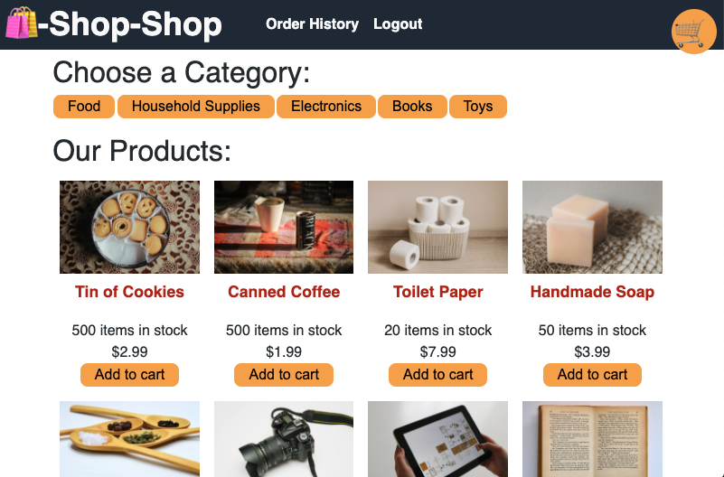

# Redux Store 

[](https://redux-store-sean.herokuapp.com/)

[Link to deployed app on Heroku](https://redux-store-sean.herokuapp.com/)

## Description

Welcome to the Redux Store project: An opportunity to refactor an e-commerce platform so that it uses Redux. 

## Usage

Clone or fork this repo if you would like. 

Install dependencies by running the following: 

```
npm i
```


## License

This application is covered under the MIT license.

## Contributing

Submit a pull request if you would like to contribute.

## Questions
Feel free to email me at seandoesitbetter@gmail.com with any questions.

Check out my GitHub profile: [seanc0ne](https://www.github.com/seanc0ne)